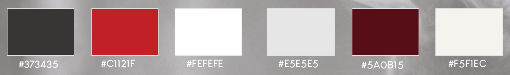
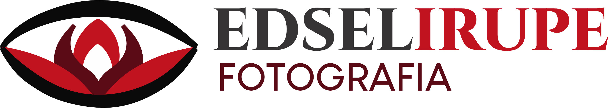

# ⚙️ TRABAJO PRACTICO FINAL: - DESARROLLO WEB

## 📚 Descripción del Emprendimiento.
Edsellrupe es un proyecto fotográfico que nace desde lo más íntimo: el deseo de preservar instantes únicos y significativos. Iniciamos como una pareja apasionada por la fotografía, descubriendo que podíamos transformar ese hobby en algo hermoso, auténtico y profesional. Lo que comenzó como una inquietud artística hoy se ha convertido en una propuesta con identidad propia, donde cada toma busca dejar huella.

Nos destacamos por una atención cercana, sensible y empática. Nuestro enfoque no es solo técnico, sino también emocional: entendemos que detrás de cada sesión hay una historia que merece ser contada con calidez, creatividad y respeto. Desde recién nacidos hasta adultos mayores, nos inspira capturar la esencia de las personas en todas las etapas de la vida.

### 📝 Nombre del Emprendimiento.
+ Edsellrupe - Fotografía.

### 👥 Dueños del Emprendimiento.
+ Villa Fernanda Irupé y Matías Ezequiel Velazquez.

### 📌 Ubicación.
+ Copiapó, Eva Perón y, K5340 Tinogasta Catamarca.

---

### 📗 Sistemas De Turnos.
Mediante Sesiones Programadas:
* Eventos (fiestas).
* Sesiones particulares.
* Sesiones temáticas.
* Sesiones infantiles, escuelas, jardines.
* Sesiones individuales y grupales.

---

## 🪪 Identidad Visual: Paleta de Colores.
Nuestra paleta de colores está cuidadosamente seleccionada para acompañar la esencia de la marca: negro, blanco, rojo y una gama de grises y marfil:

El negro aporta fuerza y sobriedad.
El blanco, pureza y claridad visual.
El rojo, pasión y calidez emocional.
Los tonos grises y crudos equilibran la composición, aportando neutralidad y elegancia a cada pieza visual.

Esta paleta evita conscientemente colores como el amarillo, naranja o rosa, ya que no se alinean con nuestro estilo gráfico ni con la atmósfera que deseamos transmitir.

El resultado es una identidad visual moderna, sobria y con carácter, que potencia nuestras imágenes y refuerza la experiencia emocional de cada cliente.

## 📸 Logotipo.

El logotipo de Edsellrupe está compuesto por un icono distintivo y nuestro nombre, reflejando nuestra identidad visual de forma clara y profesional. El símbolo central es un ojo estilizado que encierra una flor, fusión de dos elementos que nos representan profundamente. El ojo simboliza la mirada atenta del fotógrafo, siempre en busca de belleza y verdad; la flor, en cambio, remite a lo natural, lo sensible y lo que florece desde adentro. La elección de un estilo minimalista busca reforzar la elegancia y simplicidad de nuestro trabajo, dejando espacio para que la imagen hable por sí sola. La tipografía combina fuerza y calidez, alternando lo clásico con un toque moderno. Todo en el logotipo está pensado para transmitir curiosidad, confianza y profesionalismo, alineado con nuestros valores y la experiencia que ofrecemos.

## 👤 Público Dirigido.
El emprendimiento fotográfico Edsellrupe está orientado a personas y familias de la ciudad de Tinogasta y zonas cercanas que desean preservar momentos significativos mediante fotografías profesionales.

Su público objetivo incluye:

* Familias, interesadas en sesiones familiares, fotografías de maternidad, recién nacidos y celebraciones especiales.

* Padres de niños y adolescentes: Que buscan registrar cumpleaños, comuniones.

* Jóvenes y adultos: Para sesiones personales, académicas, laborales o artísticas.

* Parejas: Que desean realizar sesiones de compromiso, aniversarios o fotografías especiales.

* Adultos mayores: Interesados en conservar recuerdos familiares y retratos profesionales.

---

* Organizadores de eventos: Que requieren cobertura fotográfica para cumpleaños, fiestas, reuniones sociales y eventos culturales.

Dueño de su enfoque cercano, sensible y personalizado, Edsellrupe se dirige principalmente a personas que valoran la calidad fotográfica y la preservación de recuerdos significativos, buscando una experiencia profesional y emocionalmente enriquecedora.

## ‼️ Problemáticas y Posibles soluciones.

| Problemática | Posible Solución Informática |
| :--- | :--- |
| Los clientes no encuentran fácilmente cómo reservar una sesión fotográfica o consultar la disponibilidad. | Implementar un sistema de reservas online con calendario interactivo, donde los clientes puedan seleccionar fecha, horario y tipo de sesión. Además, enviar confirmaciones automáticas por correo electrónico o WhatsApp. |
| Puede haber confusión respecto a señas, pagos pendientes o presupuestos enviados. | Incorporar un módulo de gestión financiera que permita registrar pagos, emitir comprobantes y controlar saldos pendientes. |
| Las consultas pueden perderse entre mensajes de diferentes plataformas como WhatsApp, Instagram o Facebook. | Implementar formularios de contacto centralizados y respuestas automáticas para consultas frecuentes. |
| Algunos clientes olvidan la fecha o el horario de la sesión contratada. | Enviar recordatorios automáticos mediante correo electrónico, SMS o WhatsApp antes de la fecha programada. |

## 🎯 Objetivos del Proyecto

### Objetivo General.
Diseñar e implementar una solución informática para el emprendimiento fotográfico Edsellrupe que permita optimizar la gestión de clientes, reservas, sesiones fotográficas y entrega de trabajos, mejorando la organización interna y la experiencia de los usuarios.

---

### Objetivos Específicos
* Desarrollar un sistema web que permita a los clientes consultar servicios y reservar turnos de manera sencilla.

* Centralizar la información de clientes y sesiones fotográficas en una base de datos segura y organizada.

* Facilitar la administración y seguimiento de los trabajos fotográficos desde su contratación hasta su entrega final.

* Implementar recordatorios automáticos para reducir ausencias y mejorar la puntualidad en las sesiones programadas.

* Brindar un espacio digital donde los clientes puedan acceder y descargar sus fotografías de forma segura.

* Optimizar la gestión de pagos, presupuestos y estados de los servicios contratados.

* Mejorar la comunicación entre el emprendimiento y sus clientes mediante formularios de contacto y notificaciones automáticas.

* Aplicar tecnologías SPA y PWA para ofrecer una experiencia rápida, accesible y adaptable a dispositivos móviles.

## 🖥️ Propuestas Tecnológicas.
### Frontend (Interfaz de Usuario)
* HTML5: Estructura semántica de la página web.
* Taildwind: Diseño y estilos visuales.
* JavaScript: Interactividad y validación de formularios.
* React + Vite: Desarrollo de una SPA (Single Page Application) para una experiencia de navegación rápida y dinámica.

## 📊 Análisis Técnico.
Para el desarrollo de la solución informática destinada al emprendimiento fotográfico Edsellrupe, se propone la implementación de una aplicación web basada en los conceptos de SPA (Single Page Application) y PWA (Progressive Web App), tecnologías que permiten ofrecer una experiencia moderna, rápida y accesible para los usuarios.

Una SPA (Single Page Application) es una aplicación que carga una única página web y actualiza dinámicamente su contenido sin necesidad de recargar completamente el sitio cada vez que el usuario realiza una acción. En el caso de Edsellrupe, esta tecnología permitiría que los clientes naveguen entre las distintas secciones, como galería de fotografías, información de servicios, reservas de sesiones y contacto, de manera fluida y rápida.

---

Por otra parte, una PWA (Progressive Web App) combina las ventajas de una página web con características propias de las aplicaciones móviles. Esto permite que la aplicación pueda instalarse en teléfonos celulares, funcionar con un rendimiento optimizado e incluso mantener algunas funcionalidades cuando la conexión a Internet es limitada.

